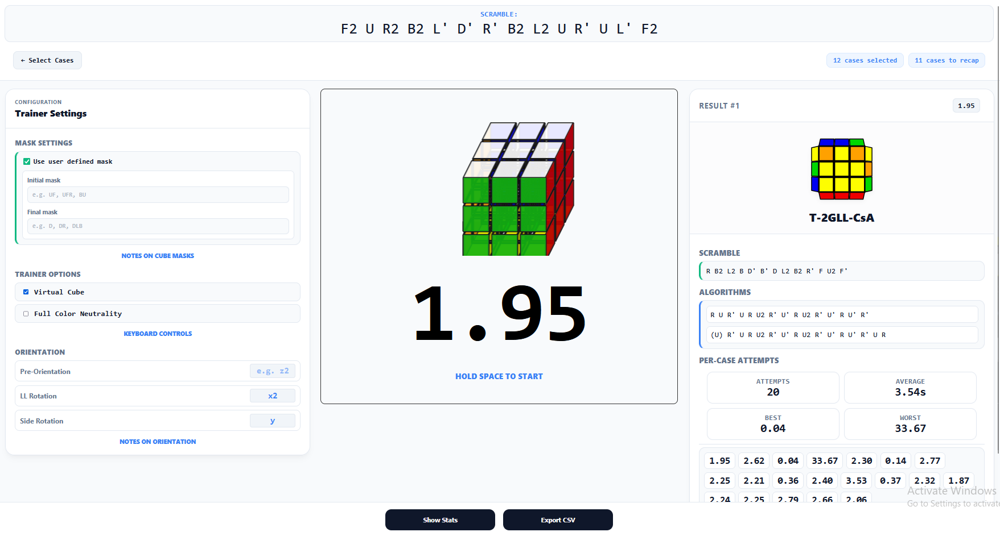

# ZBTrain

A algorithm trainer for the ZB Method (ZBLS and ZBLL) that I personally created using HTML, CSS, and JavaScript. This project unifies the best features of existing trainers, 
such as [Tao Yu’s Algorithm trainer](https://tao-yu.github.io/Alg-Trainer/) and [Roman's bestsiteever](https://bestsiteever.net/zbll/#/select) into a single trainer optimized for 
high-volume drilling and long-term retention, especially for Virtual Cube users.

> [!NOTE]  
> This project is currently a work in progress. Features such as Spaced Repetition and Smart Cube support are under active development.

## Features
* **Virtual Cube Support:** Eliminates having the need to manually scramble, and just utilize the keyboard, allowing for massive training volume.
* **Targeted Practice:** Select specific ZBLL cases or subsets to "spam" until mastered.
* **Multi-Angle Training:** Train cases from all valid angles to prevent recognition dependency.
* **Per-case and Per-subset Statistics:** Provide per-case and per-subset statistics (avg time, solve count), with the ability to export statistics in a CSV file.
* **Cube Masking, Color Neutrality, and Cool Additions to Virtual Cube**: Users have the ability to mask certain stickers of the cube, and also go for color neutral attempts in their practice.

## Credits
I would like to to thank the following people for contributing to my project (directly, and indirectly):  

* crystalcube for being such a good mentor, especially in JavaScript. I still am getting the hang of JavaScript since I've only used it in one previous project so far.  
* Roman Strakhov for having the casemap for both algorithms and scrambles, it saved a lot of mental load from me having to generate them myself.  
* namisama for letting me use the features I always wanted to implement in my trainer (color neutrality, presets, masks, etc.)  
* Morgan Yeh for some of the inspiration from his ZBLS trainer.  
* Harry Richman for some of the code in the virtual cube, really useful and also saved me some mental load on creating my own!  
* masadl for some of the functions in presets, and giving inspiration from his ZB trainer.  
* USSB for the moral support, go check out his [website](https://solved.no)).
